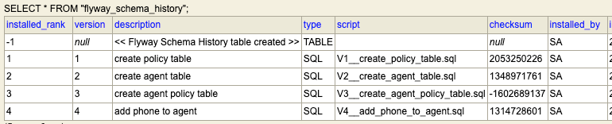

a) Po co sa migracje bazy danych? Dlaczego ddl-auto=create-drop nie nadaje sie do produkcji?

        Migracje sa po to aby zmiany na bazie danych byly widoczne dla kazdej osoby zaangazowanej w tworzenie projektu. Kazda zmiana jest zapisywana jako osobny plik sql.
        Kazdydeweloper ma dostep do historii zmian.
        ddl-auto=create-drop nie nadaje sie do produkcji, poniewaz podczas resetu aplikacji dane z bazy sa tracone(usuwane) i za kazdym uruchomieniem trzeba zapisywac dane jeszcze raz,
        co na produkcji moze byc katastrofa -> kazdy pracuje na innym stanie bazy danych
b) Jak Flyway wie ktore migracje juz byly wykonane?

        poniewaz sprawdza flyway_schema_history, ktore migracje juz zostaly wykonane, wykonuje tylko nowe
        i zapisuje je w flyway_schema_history.
c) Co sie stanie jesli zmienisz tresc pliku V1 po tym jak zostal juz wykonany?

        jezeli zmienie tresc pliku V1 po tym jak zostal jua wykonany to aplikacja nie wstanie, bo Flyway sprawdza checksum (hash) pliku — jeśli się 
        zmienił, wykrywa niespójność i blokuje start
d) Wklej wynik SELECT * FROM flyway_schema_history (z H2 Console)

        
e) Jaka jest roznica miedzy ddl-auto=create-drop, update, validate, none?

        ddl-auto=create-drop -> przy kazdym uruchomieniu aplikacji Hibernate kasuje wszytskie tabele i tworzy je od nowa na bazie encji
        ddl-auto=update -> porownuje encje z baza i dodaje brakujace kolumny lub tabele, ale musimy uwazac bo jest to ryzykowne.
        ddl-auto=validate ->  opcja gdy korzystamy z flyway (to Flyway tworzy tabele), Hiberante nie twotzy i nie zmienia tabel tylko sprawdza czy encje pasuja do istniejacego schematu, jesli nie rzuca blad.
        ddl-auto=none -> nic nie robi
f) Jaki jest workflow dodawania nowej kolumny w projekcie z Flyway?

        Workflow dodawania nowej kolumny:
            -dodajemy pole do encji np. wiek
            -piszemy plik migracji VX__add_age_to_agent.sql
            - commit obu plikow razem
            -restart aplikacji